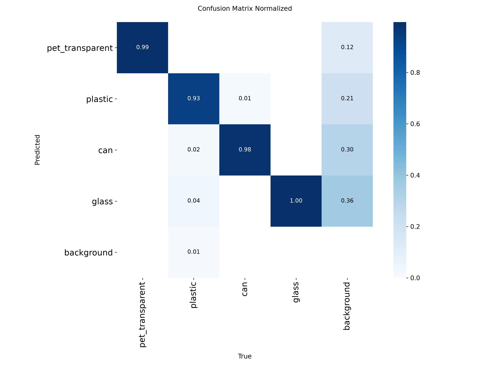
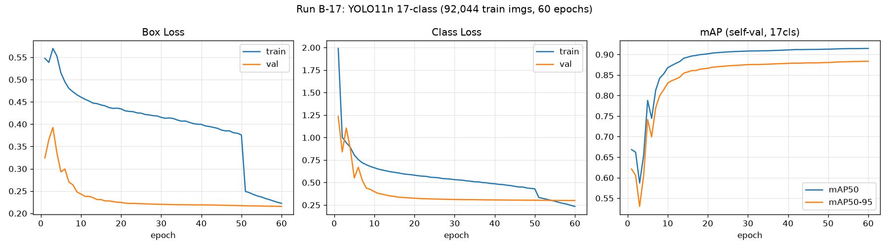

# AI 모델 학습 보고서

> 최종 갱신 2026-07-18. Run A 완료 / Run B-17 진행 중 (완료 시 본 문서 갱신 예정).
> 클래스 정의·채택 근거는 [02_클래스_설계.md](02_클래스_설계.md) 참조.

## 1. 학습 개요

| 항목 | 내용 |
|---|---|
| 데이터 | AI Hub 생활폐기물(71385) 실내형분류기 Training B1~B10 — 102,271장 / 16GB |
| 평가 | 공식 Validation 실내형분류기 12,784장 (학습 미사용, 최종 성적표 전용) |
| 모델 | YOLO11n (2.6M 파라미터) — COCO 사전학습에서 전이학습 |
| 인프라 | RunPod A40 48GB ($0.44/hr), 국내 IP로 로컬 다운로드 후 rsync 업로드 |
| 파이프라인 | aihubshell 다운로드 → `training/convert_aihub_to_yolo.py` (모드 4/9/17) → yolo train → 공식 val 평가 |

## 2. Run A — 4클래스 기준선 (완료)

### 설정
- 클래스 4종(클린만): pet_transparent / plastic / can / glass
- 학습 39,643장 (train 35,679 / self-val 3,964) — 활용률 38% (비대상 포함 이미지 제외 정책)
- 80 epoch, 640px, batch 64, workers 8 — **5.17시간, 약 $2.3**

### 결과 — 공식 Validation 4,865장 (모델이 처음 보는 데이터)

| 클래스 | Precision | Recall | mAP50 | mAP50-95 |
|---|---|---|---|---|
| **전체** | 0.984 | 0.963 | **0.985** | 0.961 |
| 투명페트 | 0.988 | 0.971 | 0.991 | 0.968 |
| 플라스틱 | 0.972 | 0.910 | 0.962 | 0.935 |
| 캔 | 0.987 | 0.974 | 0.994 | 0.973 |
| 유리 | 0.990 | 0.998 | 0.991 | 0.967 |

- **목표(클린 mAP50 ≥ 0.95) 전 클래스 통과.** 자체 val(0.989) 대비 공식 val(0.985) 격차 0.4%p → 도메인 과적합 없음
- 약점: 플라스틱 recall 0.910 (형태 다양성) — Run B-17 개선 관찰 대상
- 추론 속도: A40 기준 0.9ms/장 (Pi 5 CPU 환산 0.3~0.5초 예상 — 8초 사이클 내 여유)

### 학습 곡선

- val 손실이 전 구간 하락(역전 없음) → 과적합 없음. mAP는 13에폭경 수렴 → Run B 에폭 60으로 축소 근거
- (val 손실 < train 손실은 증강이 train에만 적용되는 YOLO 정상 패턴)

### 산출물
- 모델: `models/runA_yolo11n_4cls_best.pt` (5.3MB)
- 원본 로그·곡선: `training/results_runA/`

## 3. Run B-17 — 아파트 규정 풀스펙 (진행 중)

### 설정
- 클래스 17종: 클린 9(4품목+종이/종이팩/비닐/스티로폼/건전지) + 품목별 오염 8
- 학습 102,271장 전량 (활용률 100%), 60 epoch, batch 128, workers 8
- 1차 시도 OOM 종료(컨테이너 RAM 한도 50GB, workers 24가 원인) → workers 8로 재시작

### 결과 — 공식 Validation 12,784장 (2026-07-18 완료)

전체: mAP50 **0.912** / mAP50-95 0.880. 클래스별 mAP50:

| 클린 | mAP50 | 오염 | mAP50 |
|---|---|---|---|
| glass | 0.987 | styrofoam_dirty | 0.985 |
| styrofoam | 0.987 | paper_pack_dirty | 0.972 |
| battery | 0.983 | vinyl_dirty | 0.935 |
| can | 0.977 | pet_dirty | 0.930 |
| paper | 0.973 | plastic_dirty | 0.849 |
| vinyl | 0.944 | glass_dirty | 0.838 |
| pet_transparent | 0.922 | can_dirty | 0.833 |
| paper_pack | 0.890 | paper_dirty | 0.642 |
| plastic | 0.850 | | |

### 판정 (게이트 대비)

- [x] 신규 품목 recall ≥ 0.8 → **통과** (paper 0.963, vinyl 0.919 등)
- [ ] 클린 4종 mAP50 Run A 대비 -1%p 이내 → **표면상 미달** (pet 0.991→0.922, plastic 0.962→0.850)
- **단, confusion matrix 분석 결과 하락분의 대부분은 "같은 품목의 클린↔오염 혼동"**
  (pet 오류의 13/17%p가 pet_dirty행, plastic 오류의 11/15%p가 plastic_dirty행.
   타 품목 오분류는 1~3% 수준으로 Run A와 동급)
- **품목(재질) 레벨 병합 시 정확도: 페트류 96% / 플라스틱류 91% / 캔류 97% / 유리류 98%**
  → 분배 판정을 "품목 병합"으로 하면 Run A급 유지, 오염 여부는 별도 임계값 후처리로

### 채택안 (실무 결론)

**Run B-17 단일 모델 채택 + 2단 후처리**:
1. 분배 = 품목 병합 판정 (pet+pet_dirty→페트류 …) — 정확도 Run A급
2. 오염 표시 = dirty 신뢰도가 명확할 때만 판별불가함行 (정밀도 우선 임계값)
   — 클린↔오염 라벨 경계 노이즈(구축 데이터 특성, B2 실물 확인)는 모델이 아니라 운용으로 흡수
3. paper_dirty(0.642) 등 소수 오염 클래스는 안내 기능에서 제외 가능 (분배 무관)

### 운영 사고 기록
- 1차 시도: workers=24 → 컨테이너 RAM 50GB 한도 OOM
- 2차: workers=8로 60ep 완주. 단 학습 후 자동 검증 단계에서 재차 OOM(Killed)
  → 가중치는 무사, 공식 평가는 batch=32로 별도 실행. 교훈: **학습·평가 배치를 분리 설정할 것**

## 4. 실물 웹캠 테스트 (2026-07-18~19)

노트북 웹캠 + 검은 천 배경, 일반 생활용품 12장 (`inference/watch_and_predict.py` 채택 후처리 적용).

| 결과 | 건수 | 비고 |
|---|---|---|
| 정확 판정 | 3 | 투명 트레이→플라스틱 80% 분배, 키친타올→종이 76% 배출 코칭 |
| 판별불가(저신뢰 34~45%) | 5 | 안전망 정상 작동 — 잘못된 수거함 분배 **0건** |
| 미검출 | 2 | 물체가 어두운 노출에 묻힘 |
| 오판 | 2 | 세제통(plastic_dirty 85% + 캡→battery 59%), 물티슈(paper 67% + 유령 glass 75%) → 복수 투입 오판 |

### 원인 분석 (오류 3유형 → 근본 원인 3계층)

1. **도메인 갭** — 학습 데이터(실내형분류기)는 균일 조명·선명 초점·물체가 프레임 대부분 차지.
   웹캠은 노출 부족·초점 블러·천 주름 명암. 유령 glass는 프레임 가장자리의 어두운 빈 영역에서 발생
   (학습 유리병 다수가 짙은 갈색·녹색 → 어두운 세로 명암 패턴을 병 실루엣으로 오인, 경계 잘림 박스에 모델이 관대).
2. **경량 모델의 형태·색 프라이어 의존** — 투명 펌프캡→battery(학습 내 유일한 소형 원통 클래스),
   파란 물결 그래픽 라벨→plastic_dirty(오염=표면 불규칙 유색 패턴으로 학습됨),
   물티슈 연포장→paper(학습 vinyl은 구겨진 투명 봉투 위주, 매트한 인쇄면은 종이와 유사).
3. **후처리 허점** — 복수 투입 판정에 박스 위치·크기 검증이 없어 유령 박스 1개가 곧바로 오판으로 승격.

### 대응
- (즉시) 데모 스크립트에 스테이지 ROI + 최소 박스 면적 필터 → 유령 억제
- (실기기) 균일 무광 배경 + 밝은 확산 조명 → 원인 1 구조적 해소
- (fine-tuning) 촬영 목록 확정 근거 확보: 그래픽 라벨 용기, 물티슈류 연포장, 소형 캡·뚜껑, 투명 트레이 다각도

## 5. 이후 계획

1. Run B-17 완료 → 공식 Validation 17클래스 평가 + 4클래스 병합 비교 → 본 문서 갱신
2. (조건부) 기준 미달 시: YOLO11s 승급 또는 소수 dirty 클래스 축소 실험
3. 실기기 완성 후: 조명 박스 자체 촬영 fine-tuning (클래스당 300~500장) — 최종 정확도 결정 단계
4. 배포: best.pt → NCNN/ONNX(Pi 5), 확장 시 Hailo-8L/RKNN/STM32N6 경로 (설계서 참조)

## 6. 비용 실적

| 항목 | 비용 |
|---|---|
| 파이프라인 검증 (7/16) | $0.11 |
| Run A (학습 5.2h + 대기·업로드) | 약 $4 |
| Run B-17 (진행 중, 예상) | $3~4 |
| **누적 (예상)** | **$8 안팎** — 당초 예산 $10~20 내 |
