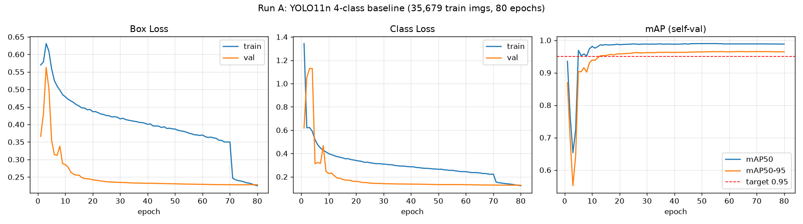
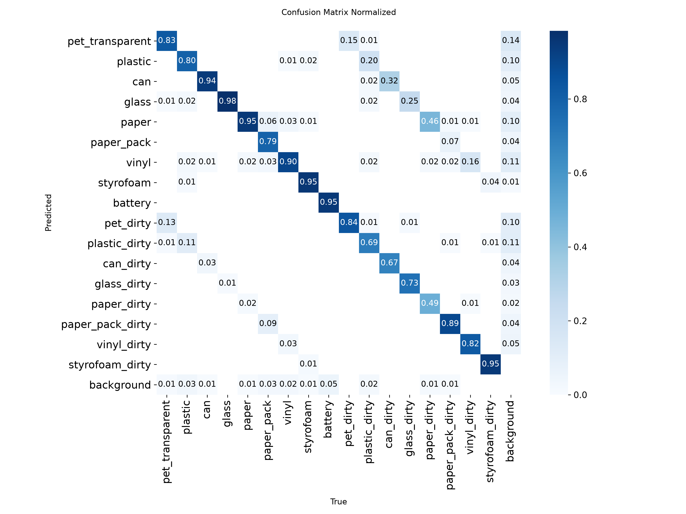
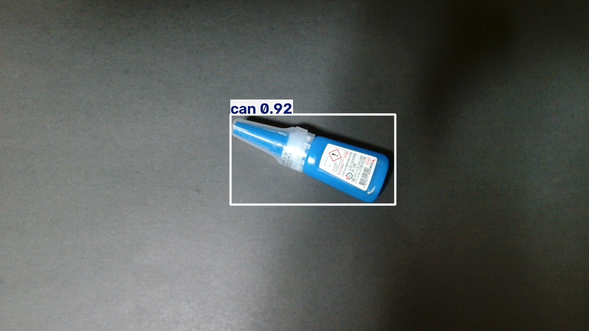
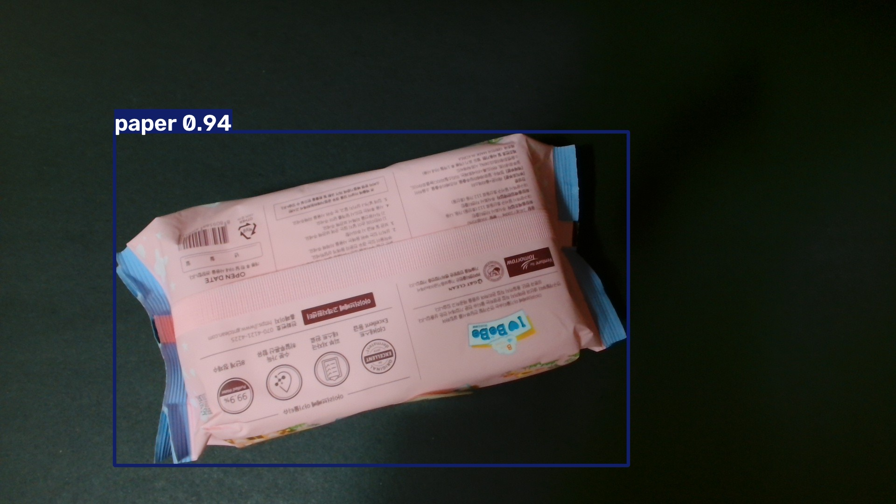
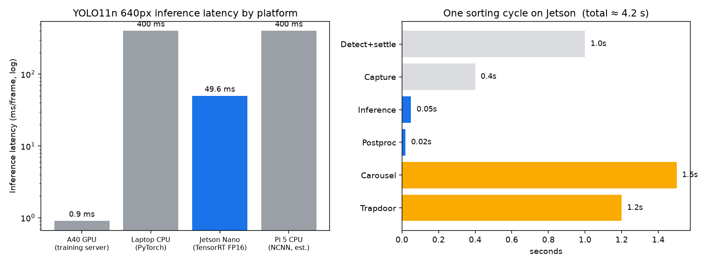
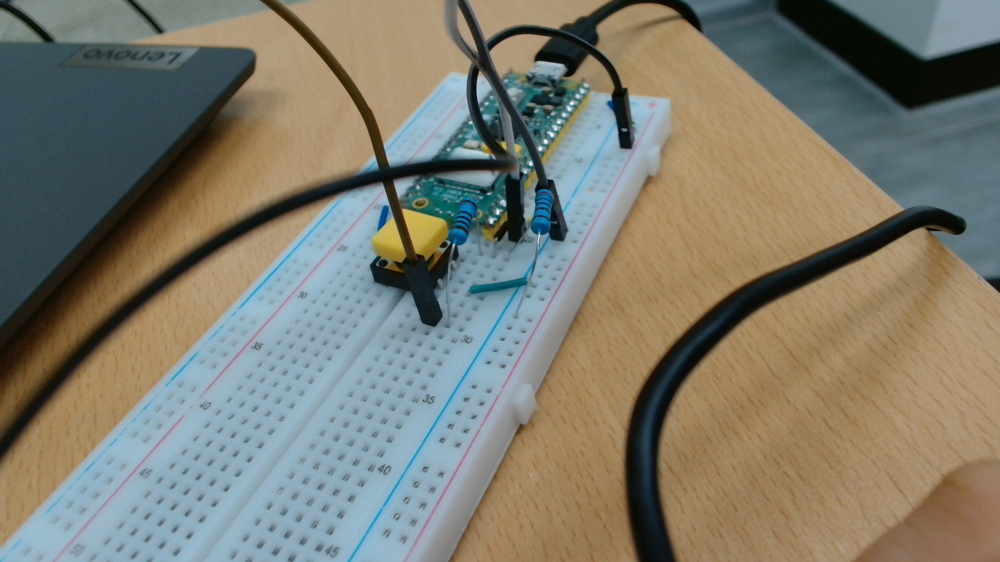
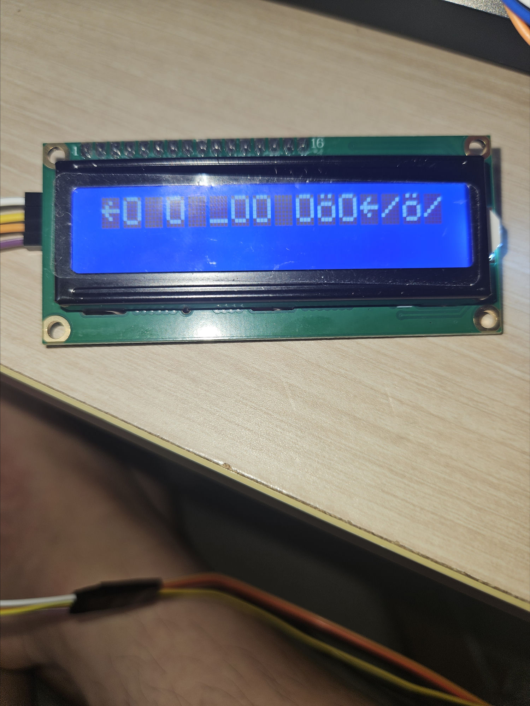
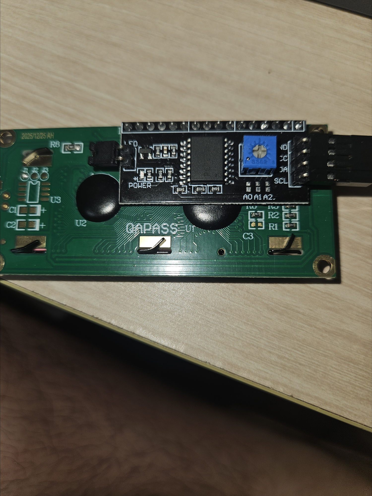
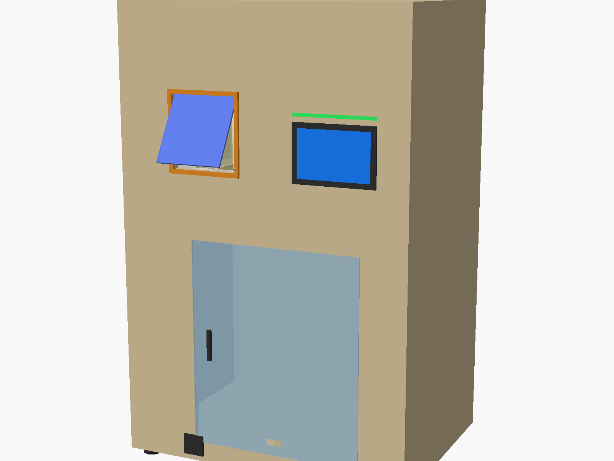
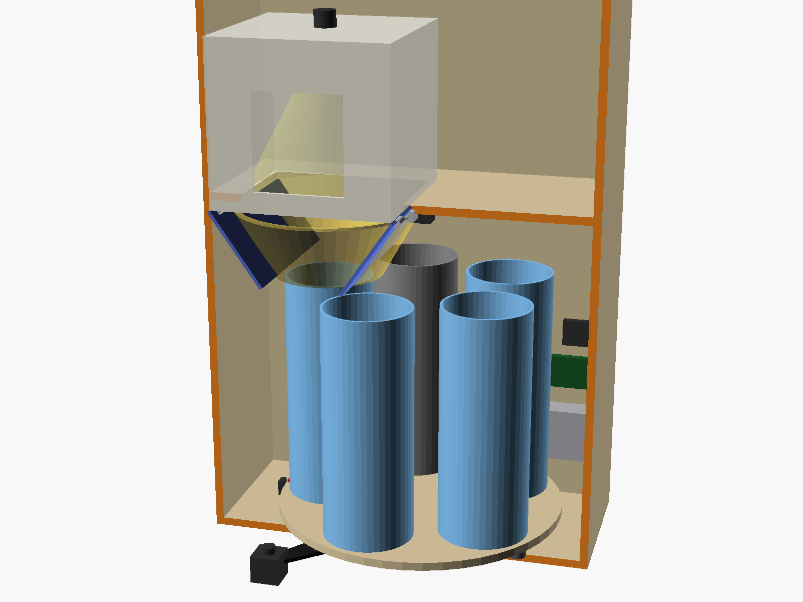

# 포트폴리오·발표 기록 — 가정용 분리수거 자동분류기

> 목적: PPT 발표·포트폴리오에 그대로 옮겨 쓸 수 있는 **상세 서술** 기록.
> 진행일지([00_진행일지.md](00_진행일지.md))가 "언제 무엇을"이라면, 이 문서는 **"왜 그렇게 했고 어떻게 해결했는가"**.
> 최종 갱신 2026-07-20. 이미지는 `docs/img/`에 축적.

---

## 1. 프로젝트 한 줄 정의

> **혼합 투입된 가정 재활용 쓰레기를 카메라 1장으로 판별해 자동 분류하고, 애매하면 분류하지 않고 되돌려주는 온디바이스 AI 기기.**

핵심 차별점 세 가지:
1. **분류(classification)가 아닌 검출(detection)** — 복수 투입을 개수로 검증할 수 있어 "1개씩" 원칙을 소프트웨어가 보증
2. **"모르면 분류하지 않는다"는 안전 설계** — 오분류로 재활용 스트림을 오염시키느니 사용자에게 되돌려줌
3. **완전 오프라인 동작** — 클라우드 없이 3만~15만원대 엣지 보드에서 실시간 판정

---

## 2. 데이터셋과 클래스 설계 — 의사결정 서사

### 2.1 왜 AI Hub 생활폐기물(71385)인가
- 국내 제품군(라벨·용기 형태)이 그대로 담긴 유일한 대규모 공개 데이터 (총 551,562장)
- **"실내형 분류기" 파트(127,844장)가 우리 기기 구도와 정확히 일치** — 밀폐 조명 박스 안, 물체 1개, 고정 카메라
- 해외 데이터셋(TrashNet, TACO)은 제품군·클래스 체계가 달라 도메인 노이즈만 증가

### 2.2 클래스 설계가 3번 바뀐 과정 (포트폴리오 핵심 서사)

| 단계 | 설계 | 근거 | 폐기 이유 |
|---|---|---|---|
| 1차 | 6종 | 초기 직관 | 데이터셋 실제 라벨 체계와 불일치 |
| 2차 | **4종**(투명페트/플라스틱/캔/유리) | "어려운 품목 제외 → 검증된 영역으로" | **B2 파트 실측 결과 활용률 4%** — 93%가 오염 배치였음 |
| 3차 | 9종(4품목+오염4+기타) | 오염 클래스 필요성 확인 | 아파트 규정 풀스펙 대응 불가 |
| **최종** | **17종**(클린 9 + 품목별 오염 8) | 데이터 활용률 **100%**, 아파트 배출 규정 전 품목 커버 | — |

**핵심 인사이트**: 데이터를 실제로 내려받아 분포를 세어보기 전까지는 4클래스 설계가 합리적으로 보였다.
실측(B2 파트 86MB 샘플)에서 **활용률 4% vs 100%**라는 숫자가 나오면서 설계가 뒤집혔다.
→ *"가정이 아니라 측정이 설계를 결정한다"*

### 2.3 "학습은 세밀하게, 추론은 병합" 전략
17종으로 학습하되 **추론 시점에 품목 단위로 병합**한다:
- 분배: `pet + pet_dirty → 페트류` (수거함은 4칸이므로)
- 오염: dirty 신뢰도가 **0.70 이상일 때만** 오염 판정 (정밀도 우선)
- 비대상(종이·비닐·스티로폼·건전지): 분류하지 않고 **배출 코칭 안내**

이 구조 덕분에 "17종 학습의 세밀함"과 "5칸 기구의 단순함"을 동시에 얻었다.

---

## 3. 학습 — 과정과 결과

### 3.1 인프라·비용
- RunPod A40 48GB ($0.44/hr), 국내 IP 제한 우회를 위해 **로컬 다운로드(16GB) → rsync 업로드** 파이프라인 구성
- 총 비용 **약 $10** (파이프라인 검증 $0.11 + Run A $4 + Run B $5.5) — 당초 예산 $10~20 내

### 3.2 Run A (4클래스 기준선)
- 39,643장 / 80epoch / 5.2시간
- **공식 Validation mAP50 0.985** (페트 0.991 / 플라스틱 0.962 / 캔 0.994 / 유리 0.991)
- 자체 val 0.989 vs 공식 val 0.985 → 격차 0.4%p, **과적합 없음**



### 3.3 Run B-17 (최종 채택)
- 102,271장 전량 / 60epoch / 약 7시간
- **공식 Validation mAP50 0.912** (17클래스)



**표면상 성능 하락(0.985 → 0.912)을 어떻게 해석했는가** — 발표에서 강조할 분석 대목:
- confusion matrix 분석 결과, 오류의 대부분이 **"같은 품목의 클린↔오염 혼동"**
  (pet 오류의 13%p가 pet_dirty행, plastic 오류의 11%p가 plastic_dirty행)
- **타 품목 오분류는 1~3%로 Run A와 동급**
- 품목 레벨 병합 시 정확도: 페트류 96% / 플라스틱류 91% / 캔류 97% / 유리류 98%
- → **결론: 모델을 다시 학습하지 않고, 후처리(병합+임계값)로 흡수**

*"숫자가 나빠 보일 때 원인을 분해하면, 재학습 대신 설계 변경이 답인 경우가 있다."*

### 3.4 운영 사고와 교훈
| 사고 | 원인 | 대응 | 교훈 |
|---|---|---|---|
| OOM 1차 | workers=24, 컨테이너 RAM 한도 50GB | workers=8 재시작 | 호스트 RAM(503GB) ≠ 컨테이너 한도 |
| OOM 2차 | 학습 후 자동 검증이 batch=128 상속 | 가중치는 무사, 평가만 batch=32로 별도 실행 | **학습·평가 배치를 분리 설정** |
| AI Hub 해외 IP 차단 | 502 에러 | 국내 로컬 다운로드 후 rsync 업로드 | 데이터 주권 제약을 파이프라인 설계에 반영 |

---

## 4. 실물 테스트 — 실패에서 얻은 것 (포트폴리오 하이라이트)

공식 Validation 0.912의 모델을 **웹캠으로 실제 생활용품에 적용**하자 전혀 다른 문제가 드러났다.

### 4.1 3유형의 오류와 근본 원인

| 사례 | 판정 | 원인 계층 |
|---|---|---|
| 검은 천 빈 배경 → `glass 75%` | 유령 검출 | **도메인 갭** — 천 주름의 세로 명암을 갈색 병 실루엣으로 오인 |
| 깨끗한 세제통 → `plastic_dirty 85%` | 오염 오판 | **프라이어 의존** — 파란 물결 그래픽 라벨을 오염 얼룩 패턴으로 |
| 투명 펌프캡 → `battery 59%` | 소형 물체 오인 | 17종 중 유일한 "소형 원통" 클래스로 수렴 |
| 물티슈(비닐) → `paper 94%` | 품목 혼동 | 학습된 vinyl은 투명 봉투 위주, 매트한 인쇄 연포장 미학습 |
| **플라스틱 본드 → `can 92%`** | **OOD 고신뢰 오분류** | **폐쇄형 검출기의 구조적 한계** |




### 4.2 가장 중요한 발견 — 환경 개선이 오류를 "더 확신 있게" 만든다

검은 천 → 회색 무광 배경판으로 바꾸자:
- 유령 검출은 **0건으로 소멸** (환경 문제였음이 증명)
- 그러나 물티슈 오분류는 **67% → 94%로 확신이 오히려 상승**

> **결론: 환경 개선은 노이즈성 오류를 없애지만, 학습 분포 밖 물체(OOD)는 더 또렷하게 틀린다.**
> 남은 오류는 환경이 아니라 **데이터(fine-tuning)로만** 해결 가능하다.

이 실험이 fine-tuning 촬영 목록을 확정해 주었다:
그래픽 라벨 용기 / 물티슈류 연포장 / 소형 캡·뚜껑 / 투명 트레이 다각도 / **비대상 물체 네거티브 샘플**

### 4.3 안전망은 설계대로 작동했다
14장 테스트에서 **잘못된 수거함으로 분배된 사례 0건**.
애매한 케이스는 전부 신뢰도 임계값(0.50)에 걸려 "판별불가 → 리턴"으로 빠졌다.
→ *"정확도보다 중요한 것은 틀렸을 때의 동작이다."*

---

## 5. 엣지 배포 — 노트북에서 Jetson Nano로

### 5.1 보드 선정 과정
| 후보 | 판단 |
|---|---|
| Pico 2 W (RP2350) | ❌ RAM 520KB — 활성값조차 불가 |
| Pi Zero 2 W (3만원) | ⭕ 가능 (NCNN, 1~2초/프레임) — 저가 대안 |
| Luckfox/Milk-V (NPU 0.5TOPS) | △ int8 변환 필수, 개발 비용 큼 |
| **Jetson Nano (보유)** | ✅ **채택** — GPU+TensorRT, 구매비 0원 |

### 5.2 배포 파이프라인
```
runB17_best.pt (PyTorch)
   → ONNX opset12 (노트북에서 변환, 11MB)
   → TensorRT FP16 engine (Jetson에서 빌드, 9.3MB)
```

### 5.3 실측 성능 (2026-07-20)
```
&&&& PASSED TensorRT.trtexec
GPU Compute Time : 49.0 ms
H2D / D2H        : 0.47 / 0.08 ms
End-to-End       : 49.6 ms  (초당 약 20장)
```



**해석**: 노트북 CPU(0.3~0.5초) 대비 **6~10배 향상**. 사이클 예산 8초에서 추론 비중이 0.6%로 축소되어,
**병목이 AI가 아니라 기구(캐러셀 회전·도어 개폐)로 이동**했다.
→ 발표 포인트: *"AI 최적화가 끝나는 지점에서 기계 설계가 시작된다."*

### 5.4 무모니터 원격 셋업 (기술적 성과)
모니터·키보드 없이 **USB 시리얼 콘솔(ttyGS0)만으로** JetPack 초기 설정을 완료:
라이선스 → 언어/지역 → 계정 생성 → 파티션 → 전력 모드(MAXN) → 네트워크
이후 SSH 키를 시리얼로 주입해 **비밀번호 없는 원격 개발 환경** 구축.

---

## 6. 하드웨어 프로토타입 — 시행착오 기록

### 6.1 구성
| 장치 | 역할 | 핀 |
|---|---|---|
| HC-SR04 | 투입 감지 | TRIG=GP16, ECHO=GP17(1k/2k 분압) |
| LCD1602 I2C | 판정 결과 표시 | SDA=GP4, SCL=GP5 |
| SG90 ×2 | 투입구·분배 구동 | GP0, GP1 (전원 분리) |



### 6.2 해결한 문제 3건

**① 초음파 "에코 없음" (수 시간 소요)**
- 증상: 측정 실패만 반복
- 진단: **전용 진단 펌웨어를 작성**해 ⓐ내부 풀업 테스트로 분압 연결 확인 ⓑ평상시 레벨 ⓒ트리거 응답을 분리 측정
- 원인: 배선은 정상, **점퍼선을 절연테이프로 맞댄 이음의 접촉 불량**
- 교훈: **테이프 접합 금지, 브레드보드 빈 줄을 중계점으로 사용**

**② LCD 통신 실패 → 글자 깨짐**
- 1단계: I2C 스캔 무응답 → **전 핀쌍 자동 탐색 펌웨어** 작성해 배선 문제 배제
- 2단계: 4가닥 재연결 후 통신 성공, 그러나 글자 깨짐
  
- 3단계: **매핑 A/B를 6초씩 번갈아 표시하는 진단 펌웨어**로 원인 특정
- 원인: 핀 매핑이 아니라 **초기화 타이밍 부족** → 나이블당 150µs, 초기화 6ms로 여유 확보
  

**③ 전원 설계**
- 규칙 확립: **빨간 레일 분리(USB 5V / 건전지 6V), 파란 레일(GND) 전부 공통**
- 근거: SG90 2개 스톨 시 1.4A — USB 한계(0.5~0.9A) 초과 → 보드 리셋

### 6.3 방법론적 성과
문제마다 **일회용 진단 펌웨어를 작성해 가설을 하나씩 배제**하는 방식을 사용했다.
(`diag.c` 초음파 3단 검사 / `i2cfind.c` 전핀 탐색 / `pinfind.c` 외부 풀업 감지 / `lcd_test.c` 매핑 A/B 비교)
→ 발표 포인트: *"추측 대신 측정 도구를 만들어 원인을 좁혔다."*

---

## 7. 3D 설계 — 코드 CAD와 자가 검증

OpenSCAD로 파라메트릭 설계 후, **헤드리스 렌더링으로 AI가 직접 결과를 보며 평가-개선을 반복**했다.




렌더 검증으로 발견한 실제 결함 2건:
1. **외닫이 트랩도어의 개방 궤적이 수거함을 관통** → 양문식이 기하학적으로 필수임을 확인(초기 "단순화" 판단을 번복)
2. **유리 낙하고 30mm vs 문짝 스윙 106mm 상충** → 스테이지를 +120mm 올려 양립

코드에 **검증식 4종을 내장**(카메라 화각 61°<66°, 낙하고, 2L 페트 수용, 도어 스윙 간섭)해 파라미터 변경 시 자동 확인.

---

## 7-1. 범위 축소와 "설계가 값을 한 순간" (2026-07-21)

12주 일정 현실화를 위해 구현 범위를 줄였다: **싱귤레이터 제외 / 분류 4칸(품목 3 + 기타) / 오염 판정 보류**.

주목할 점은 **이 축소에 재학습이 전혀 필요 없었다**는 것이다.
"학습은 17종으로 세밀하게, 추론에서 병합" 구조를 처음부터 택했기 때문에, 설정 두 줄로 끝났다:

```python
IGNORE_DIRTY = True                    # 오염 클래스를 같은 품목 클린으로 간주
BIN_ITEMS = ["pet", "can", "plastic"]  # 나머지는 전부 '기타'함
```

| 입력 | 축소 전 | 축소 후 |
|---|---|---|
| `plastic_dirty 85%` | 판별불가 + "세척 후 배출" | **플라스틱함으로 분배** |
| `glass 92%` | 유리함 분배 | 기타함 |
| `paper 88%` | 판별불가 + 배출 코칭 | 기타함 |

→ 발표 포인트: *"모델을 다시 학습하지 않고 운용 정책만 바꿔 요구사항 변경에 대응했다.
17종 학습은 지금은 과잉으로 보이지만, 나중에 오염 판정·품목 확장을 켜는 순간 그대로 되살아난다."*

### 함께 수정한 버그 — 한 물체 다중 판정
투명 페트병 하나에 `pet_transparent`와 `plastic` 박스가 동시에 잡히는 현상 발견.
원인은 **YOLO의 NMS가 클래스별로 동작**해 서로 다른 클래스의 겹친 박스를 제거하지 못하는 것.
방치하면 "서로 다른 품목 2개 = 복수 투입" 규칙에 걸려 **물체 1개를 리턴하는 오판**이 발생한다.
→ **IoU 0.55 군집화**로 겹친 박스를 한 물체로 묶고 최고 신뢰도 클래스만 대표로 채택.
(같은 원인의 과거 사례: 세제통 본체 `plastic_dirty` + 캡 `battery` → 복수 투입 오판)

## 7-2. 전자동 사이클 완성 (2026-07-22~23) — 시스템 통합의 장

이틀간 골판지 프로토타입 조립과 소프트웨어 통합으로 **전원만 꽂으면 도는 완전 자동 분류기**가 완성됐다.

### 최종 아키텍처

```
[쓰레기 투입]
   → Pico: 초음파 감지 → 3초 안정화(손 빼는 시간) → "DETECT"
   → Jetson: C920로 1초간 10프레임 촬영 → TensorRT 프레임별 판정(GPU, 총 ~1초)
   → ★ 다수결(최다 득표 판정 채택) ★ → "SORT PAPER|PLASTIC|VINYL" 또는 "REJECT"
   → Pico: 회전판 정렬(0/90/180°) → 투입구 개방(90→180°) → 닫힘 → LCD "LAST: ○○"
   → 2초 쿨다운 → 재무장 (사이클 중에는 초음파 무시)
```

### 핵심 설계 결정과 근거

1. **10프레임 다수결 (시간축 앙상블)** — 단일 프레임의 우연한 오판(유령 박스·순간 반사·신뢰도 출렁임
   34%↔80% 실측)이 소수표로 묻힌다. GPU 추론 50ms 덕분에 10장 분석이 1초 — Nano에서만 가능한 설계.
2. **상태머신으로 초음파 게이팅** — 분석·분배 중 초음파를 완전히 무시해 문짝·회전판 움직임의 오감지 차단.
   REJECT 시엔 문을 열지 않아 물체가 사용자에게 돌아감 (오분배 원천 차단 유지).
3. **3칸(0/90/180°) 확정** — SG90의 180° 물리 한계(내부 포텐셔미터·스토퍼)와 십자 프레임(팔 90°)의
   기하학적 정합. "각도를 270°까지 소프트웨어로?"라는 질문에 대한 답: **한계는 코드가 아니라 기구에 있다.**
4. **systemd 자동 시작** — `sudo reboot` 실증: 전원 인가 후 약 40초 만에 무인 가동 (Restart=always 자가복구 포함).

### 통합 과정의 실전 문제 해결 (발표 소재)

| 문제 | 진단 | 해결 |
|---|---|---|
| Jetson에서 Pico 시리얼 EACCES | 계정이 dialout 그룹에 없음 | usermod + 재로그인 세션 |
| 원격 재시작 명령이 자꾸 무응답 | `pkill -f`가 명령 자신을 매치해 자기 종료 | 브래킷 패턴 `"jetson_bridg[e]"` |
| LCD가 사이클 후 깨짐 | 서보 구동 노이즈가 I2C 나이블 오염 | 사이클 복귀·30초마다 재초기화(자가 복구) |
| 재부팅 후 카메라 소실 | USB 헐거움 | 실기기 조립 시 케이블 고정 반영 |
| 펌웨어 굽기마다 케이블 이동 | — | Jetson에서 부트로더 드라이브 원격 마운트로 직접 굽기 |

### 시연 영상 (2026-07-23)

조립 완성체 실동작 영상 — `docs/img/demo_cycle_1~4*.mp4` (LCD 상태 전환과 기구 동작 포함).
PPT 삽입용 스틸: `demo_still_lcd_detected.jpg`(감지 3초 대기), `demo_still_lcd_analyzing.jpg`(분석 중).

### 실기 검증 기록

- **REJECT 경로 실증**: 투명 지퍼백 → 10프레임 전부 미검출 → 리턴. 안전망 정상 + "투명·평면 비닐"이
  모델 사각지대임을 재확인 (fine-tuning 1순위 근거)
- **모델 동일성 3중 검증**: ONNX md5 일치 / 17클래스→그룹 매핑 완전 동일 / 동일 이미지 교차 추론
  (PyTorch fp32 can 0.479 vs TensorRT fp16 can 0.441 — 변환 오차 정상 범위)
- **발열**: 상시 추론 부하에서 GPU 39°C (스로틀링 한계 97°C 대비 여유 — 방열판만으로 충분)
- **운용 파라미터**: 신뢰도 리턴 기준 0.40 (0.50에서 완화 — 다수결 도입으로 프레임 단위 오차 흡수력이
  생겨 낮출 여지 확보), 감지 15cm/해제 18cm 히스테리시스

## 8. 현재 상태와 남은 과제 (2026-07-23 기준)

### 완료
- [x] 데이터셋 분석·변환 파이프라인 (17클래스, 활용률 100%)
- [x] Run A / Run B-17 학습 및 채택 결정
- [x] 채택 후처리(병합·임계값·코칭) 구현 및 실물 검증
- [x] 웹캠 실물 테스트 → 오류 유형 분석 → fine-tuning 목록 확정
- [x] Jetson Nano 셋업 + TensorRT FP16 변환 (49.6ms 실측)
- [x] Pico 하드웨어 검증 (초음파·LCD·서보) + 진단 펌웨어 방법론
- [x] 골판지 프로토타입 조립·캘리브레이션 (투입구 90/180°, 회전판 3칸)
- [x] **전자동 사이클 완성** — 감지→10프레임 다수결→분배, systemd 자동 시작, 노트북 분리 자립 운용
- [x] fine-tuning 수집 도구 (반자동 라벨링: 위치=모델, 클래스=사람)
- [x] 3D 모델 v1.1 (검증식 내장)

### 남은 과제
- [ ] fine-tuning 데이터 수집(400장+) → 재학습 → Jetson 재배포 (지퍼백·물티슈 해결)
- [ ] SORT 3경로 실물 분배 정밀 검증 (봉투 정렬 각도 보정)
- [ ] 발표자료·기술서 제작 (본 레포 기반)
- [ ] (여유 시) MDF 실기기, 서보 승급(MG996R), 종료 버튼

---

## 9. 발표용 수치 요약 (암기용)

| 지표 | 값 |
|---|---|
| 학습 데이터 | 102,271장 / 17클래스 / 활용률 100% |
| 모델 | YOLO11n, 2.6M 파라미터, 5.3MB |
| 공식 Validation | mAP50 **0.912** (품목 병합 시 96~98%) |
| 학습 비용 | 약 **$10** (A40 12시간) |
| 엣지 추론 | **49.6ms/프레임** (Jetson Nano TensorRT FP16) |
| 예상 사이클 | **약 4.2초** (추론 0.05초, 나머지는 기구) |
| 실물 테스트 | 14장 중 오분배 **0건** (안전망 작동) |
