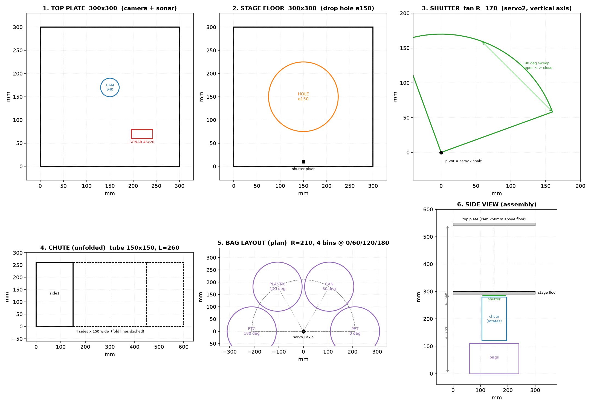

# 골판지 프로토타입 제작도 — 4분류기

> 작성 2026-07-21. 범위 축소안(싱귤레이터 제외 / 4칸 / 오염 무시) 기준.
> 펌웨어: `pico_sorter/build/pico_sorter.uf2` · 도면 이미지: `img/proto_cardboard_cutplan.png`

## ⚠️ v2 구조 변경 (2026-07-21 오후)

참고 제품 사진 기반으로 **회전 슈트 → 수거함 회전판(캐러셀) 방식**으로 변경. CAD 설계와 동일 철학.

| 서보 | v1 (폐기) | **v2 (현재)** |
|---|---|---|
| 서보1 (GP0) | 슈트 회전 | **투입구 왼문** |
| 서보2 (GP1) | 셔터 | **수거함 회전판** (0/60/120/180° = 4칸) |
| 서보3 (GP2) | — | **투입구 오른문** (왼문과 반대방향 동기) |

동작: 양문에 물체 → 판정 → **회전판이 칸 정렬 → 양문 개방 → 낙하 → 닫힘**.

### ⚠️ v3 실기 확정 (2026-07-22) — 실측 캘리브레이션
실물 조립 결과 **투입구는 서보 1개(단문)**로 확정. 배선·각도 실측값 (실제 작동 코드의 기준):

| 항목 | 값 |
|---|---|
| 투입구 서보 | **물리핀 1 (GP0)** — 닫힘 **90°**, 완전 열림 **180°** (증가 방향, 열림양 90) |
| 회전판 서보 | **물리핀 2 (GP1)** — 칸 각도 0/60/120/180° (실측 보정 예정) |
| 감지 | HC-SR04 (FSR 검토 후 초음파로 회귀), TRIG=GP16/ECHO=GP17 분압 |
| 테스트 펌웨어 | `pico_sonar_test.uf2` (기본값에 캘리브레이션 반영됨) |

### 분배 체계 확정 v2 — 3칸 (2026-07-23 오전 확정)

십자 프레임(팔 90° 간격)과 SG90 180° 한계에 맞춰 **3칸으로 확정** — 프레임 개조 불필요.

| 회전판 각도 | 칸 | 들어가는 것 |
|---|---|---|
| **0°** | 종이 (PAPER) | paper |
| **90°** | 플라스틱 (PLASTIC) | plastic + **투명페트**(재질 병합) |
| **180°** | 비닐 (VINYL) | vinyl (물티슈류는 fine-tuning 후) |
| 수거함 없음 | **리턴** | 캔·유리·종이팩 등 그 외 전부 + 판별불가 → `REJECT` (문 안 열림, 회수) |

- 오염 여부 감지 안 함 (`IGNORE_DIRTY=True`)
- 판정(`jetson_infer.py`·`laptop_stream.py`)·펌웨어(`pico_sonar_test`) 반영 완료

### 자동 사이클 상태머신 (펌웨어 내장)

```
[대기] --물체 감지(15cm)--> [안정화 3초] --경과--> "DETECT" 송신 → [분석대기]
                              └-치우면 취소            (초음파 무시)
[분석대기] --SORT 수신--> 회전판 정렬 → 문 열기 → 닫기 → "DONE" → [정착 2초] → [대기]
           --REJECT 수신--> 안내 표시 → 물체 회수될 때까지 대기 → [대기]
           --30초 무응답--> 안전 복귀 → [대기]
```

- 사이클 진행 중에는 초음파를 인지하지 않음 (문 개폐·회전 중 오감지 방지)
- 안정화 3초 = 사용자가 손을 빼는 시간 (LCD "WAIT 3 SEC" 안내)
아래 본문의 "회전 슈트" 관련 재단(④⑤)은 **회전판(원판 ø400 안팎) + 수거함 4개 배치**로 대체.
양문 재단: 스테이지 바닥판을 반으로 나눠 각 문 150×150, 경첩 대신 서보 축 직결.
캘리브레이션: `d1`/`d2`/`d3` 개별 각도 → `cfg c1/c3/amt/b0~b3`로 저장 (재부팅 시 초기화되므로 확정 후 코드 반영).



## 1. 설계 원칙 — 왜 이 구조인가

**두 서보 모두 회전축을 수직으로 둔다.** 중력이 회전을 방해하지 않으므로,
SG90의 약한 토크(1.8kg·cm)로도 여유롭게 동작한다.
(문짝을 들어 올리는 방식이면 MDF·물체 무게에서 4kg·cm가 필요해 SG90으로는 불가)

| 서보 | 역할 | 축 | 동작 |
|---|---|---|---|
| 서보1 (GP0) | 슈트 회전 | 수직 | 0° / 60° / 120° / 180° = 4칸 |
| 서보2 (GP1) | 셔터 개폐 | 수직 | 10°(닫힘) ↔ 100°(열림) |

## 2. 재단 목록 (골판지 5T 기준)

| # | 부품 | 치수 | 수량 | 가공 |
|---|---|---|---|---|
| 1 | 상판 | 300 × 300 | 1 | 카메라 ø40 구멍(중앙에서 뒤로 20), 초음파 46×20 사각 구멍 |
| 2 | 스테이지 바닥판 | 300 × 300 | 1 | 중앙 **ø150 낙하 구멍**, 앞쪽 가장자리에 셔터축 구멍 ø4 |
| 3 | 셔터판 | 부채꼴 R170, 각도 100° | 1 | 축 구멍 ø4 (꼭짓점) |
| 4 | 슈트 | 150 × 260 × 4장 (전개 600 × 260) | 1 | 접어서 사각통, 하단을 45° 사선 컷 |
| 5 | 슈트 회전판 | ø200 원판 | 1 | 중앙 축 구멍, 슈트를 이 판에 고정 |
| 6 | 측벽 | 300 × 550 | 2 | — |
| 7 | 뒷벽 | 300 × 550 | 1 | — |
| 8 | 앞벽 | 300 × 250 (윗부분만) | 1 | 투입구 130 × 140 |

**골판지 대신 택배 상자를 재활용**해도 무방하다. 정확도가 필요한 것은 ②의 ø150 구멍과 ③ 셔터의 축 위치뿐이다.

## 3. 봉투 배치 (⚠️ 도면에서 수정된 치수)

도면 이미지는 R=210으로 그려져 있으나, **봉투 지름 200mm 기준으로는 간격이 10mm뿐이라 너무 빠듯하다.**
아래 중 하나를 택할 것:

| 안 | 회전 반경 R | 인접 봉투 중심거리 | 여유 | 전체 폭 |
|---|---|---|---|---|
| A (권장) | **240mm** | 240mm | 40mm | 약 680mm |
| B | 210mm | 210mm | 10mm | 620mm | 
| C | 210mm + 봉투 ø160 | 210mm | 50mm | 580mm |

- 중심거리 = 2 × R × sin(30°) = R (60° 간격일 때)
- 폭이 부담되면 **C안**(작은 봉투)이 현실적이다.

배치 각도: **0° = PET / 60° = CAN / 120° = PLASTIC / 180° = ETC** (펌웨어 `BIN_ANGLE`과 일치)

## 4. 조립 순서

1. **스테이지 바닥판**(②)에 ø150 구멍을 뚫고, 앞 가장자리에 서보2를 고정 (축이 위를 향하게)
2. **셔터판**(③)을 서보 혼에 결합 → 10°에서 구멍을 완전히 덮고, 100°에서 완전히 비켜나는지 손으로 확인
3. **상판**(①)을 550mm 높이에 설치, 카메라를 구멍에 끼워 아래를 보게 (스테이지 바닥까지 약 250mm)
4. 초음파 센서를 상판에 고정, **정면이 스테이지 바닥 중앙**을 향하게
5. **슈트 회전판**(⑤) 중앙을 서보1에 결합, 그 위에 접은 슈트(④)를 세워 고정
   - ⚠️ **회전판 무게를 서보축에 직접 싣지 말 것.** 볼트+와셔 또는 폐 CD 스핀들로 별도 지지하고,
     서보는 회전만 담당하게 한다 (기어 파손 방지)
6. 봉투 4개를 3항의 각도·반경에 맞춰 걸이(옷걸이·철사)로 매단다
7. 슈트 출구가 각 봉투 입구 중앙에 오는지 **손으로 4칸 전부 돌려 확인** 후 서보 결선

## 5. 배선 (기존 브레드보드 그대로)

| 장치 | 핀 |
|---|---|
| 슈트 서보 신호 | GP0 (물리핀 1) |
| 셔터 서보 신호 | GP1 (물리핀 2) |
| HC-SR04 | TRIG=GP16, ECHO=GP17 (1k/2k 분압) |
| LCD1602 I2C | SDA=GP4, SCL=GP5 |
| 서보 전원 | **건전지 AA×4 별도 레일**, GND는 전부 공통 |

상세는 [04_하드웨어_배선.md](04_하드웨어_배선.md) 참조.

## 6. 펌웨어 — `pico_sorter.uf2`

### 시리얼 프로토콜

| 방향 | 메시지 | 의미 |
|---|---|---|
| Pico → 상위 | `DETECT <cm>` | 물체 투입 감지 → 상위가 촬영·판정 시작 |
| Pico → 상위 | `CLEAR <cm>` | 물체 빠짐 |
| Pico → 상위 | `DONE <칸>` | 분배 완료 |
| 상위 → Pico | `SORT PET\|CAN\|PLASTIC\|ETC` | 해당 칸으로 분배 실행 |
| 상위 → Pico | `REJECT <사유>` | 셔터 열지 않고 리턴 안내 표시 |
| 상위 → Pico | `READY` / `BUSY` | LCD 상태 표시 |
| 상위 → Pico | `TEST` | 4칸 순회 + 셔터 자가 점검 |
| 상위 → Pico | `PING` | `PONG` 응답 (연결 확인) |

### 분배 동작 시퀀스
```
SORT CAN 수신
  → LCD "SORTING / -> CAN"
  → 슈트를 60°로 천천히 회전 (3°씩, 급가속 전류 스파이크 방지)
  → 0.25초 정착 대기
  → 셔터 열기 (100°) → 0.9초 낙하 → 셔터 닫기 (10°)
  → "DONE CAN" 송신
```

### 안전 설계
- 회전은 **3°씩 20ms 간격**으로 이동 — SG90 2개가 동시에 급가속하면 전압 강하로 보드가 리셋되는 문제를 방지
- `REJECT`는 **셔터를 열지 않는다** — 물체가 스테이지에 남아 사용자가 회수
- 초음파는 0.2초 주기, 히스테리시스 15cm/18cm (경계 떨림 방지)

## 7. 제작 후 점검 순서

1. `pico_sorter.uf2` 굽기 → 시리얼 모니터(115200) 연결
2. `PING` → `PONG` 확인
3. `TEST` → 4칸 순회 + 셔터 개폐 육안 확인 (**물체 없이 먼저**)
4. `SORT CAN` → 슈트가 60°로 가고 셔터가 열리는지
5. 페트병을 스테이지에 올려 `DETECT` 메시지가 뜨는지
6. 전체 사이클: 물체 투입 → DETECT → (상위가 판정) → SORT → 봉투에 들어가는지

## 8. 알려진 한계 (발표 시 언급할 것)

- **골판지 강성 부족**: 슈트가 흔들려 낙하 지점이 어긋날 수 있음 → 실기기는 MDF 5~12T
- **SG90 정밀도**: ±2~3° 오차 → 봉투 입구를 크게 잡아 흡수 (여유 40mm 권장 근거)
- **초음파와 연질 재료**: 비닐·천은 반사가 약해 감지를 놓칠 수 있음 → 카메라 미검출 판정이 2차 방어
- **싱귤레이터 없음**: 한 번에 하나씩 투입을 사용자가 지켜야 함. 복수 투입 시 모델이 감지해 리턴
